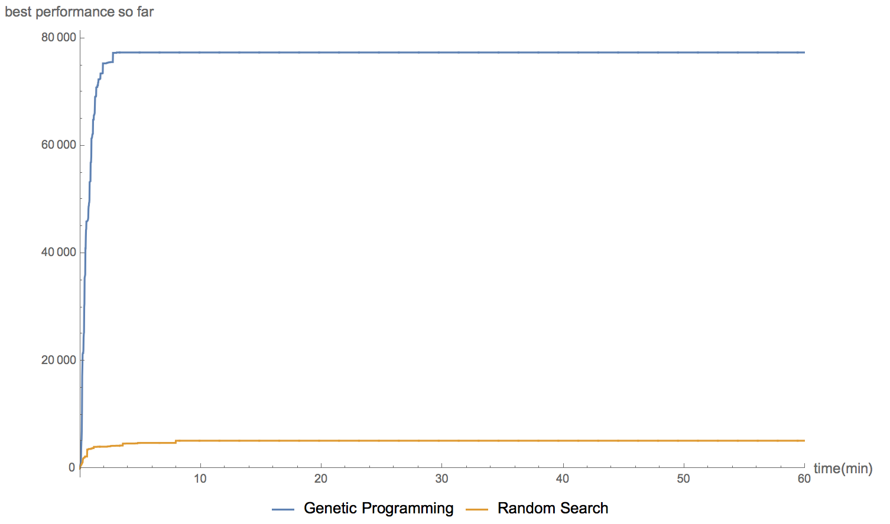
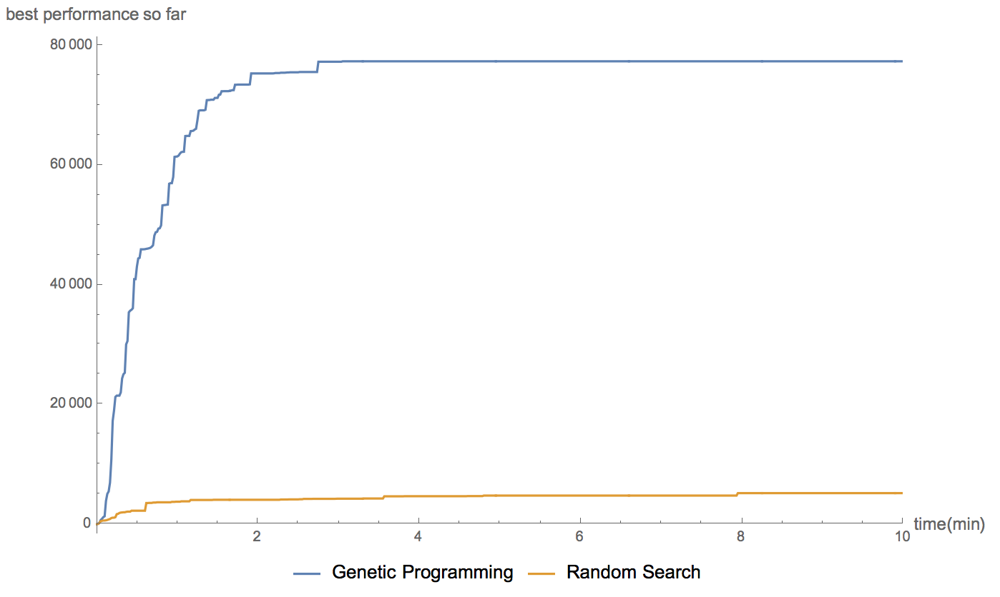

## Compare Singularity with random search

To implement a random search version of Singularity, we replaced Singularity's 4 genetic operators (crossover, mutation, copy, and constFold) with a new operator that randomly generate RCGs. We compared the performance of the original algorithm with this random version on the Guava ImmutableBiMap example. Results were aggregated over 30 runs with 1 hour time limit for each. To see the initial improvement more clearly, we also plot the performance within the first 10 minutes.

* The 1 hour plot:

* The first 10 minutes:

We also plot the performance-time curve of the best run from GP and random search. As we can see from the results, GP steadily and significantly improve over time, while the random search.

* GP best run:

* Random Search best run:

