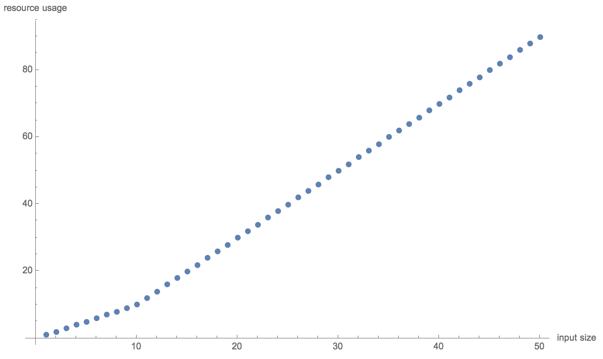
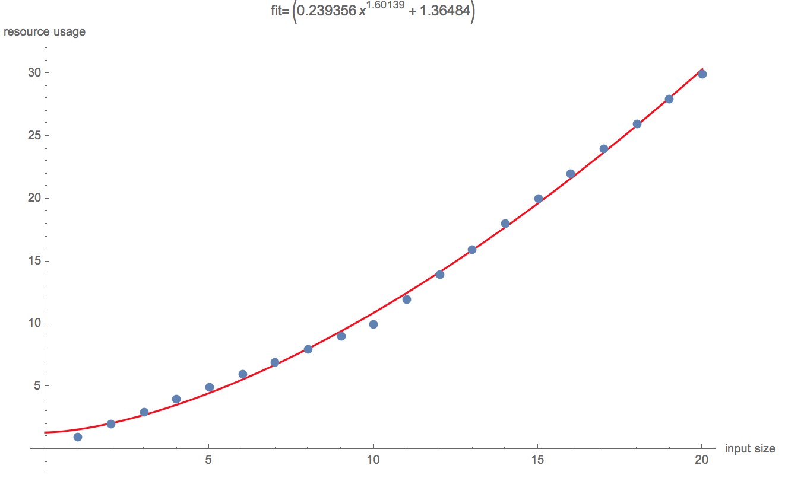
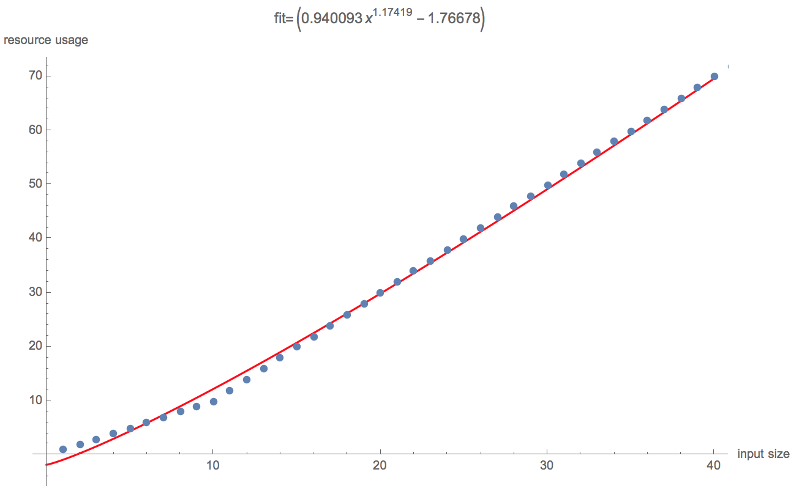

The "resource usage vs input size" curve of a target program *P* is usually very irregular when input size is small. Hence, to get an accurate power-law fit of the asymptotic behvavior of *P*, we need to use sufficiently large inputs such that the irregularity is "smoothed out" by the large fitting scale.

 For example, it is possible for *P* to have the following resource usage behavior (taken from one of our benchmarks), which is linear asymptotically:

But if we only use small inputs to fit a power law model `a  *x^b + c`, we get the following inaccurate non-linear fit, which gives us `b = 1.6`:

We can fit a more accurate curve by using larger inputs:

